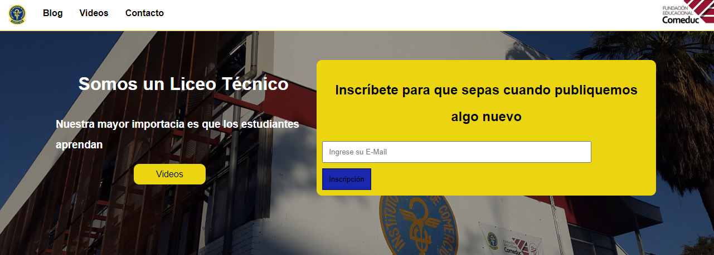
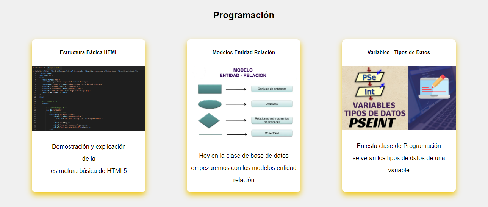
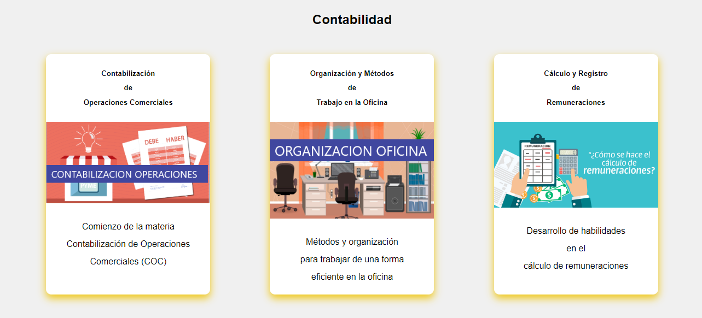
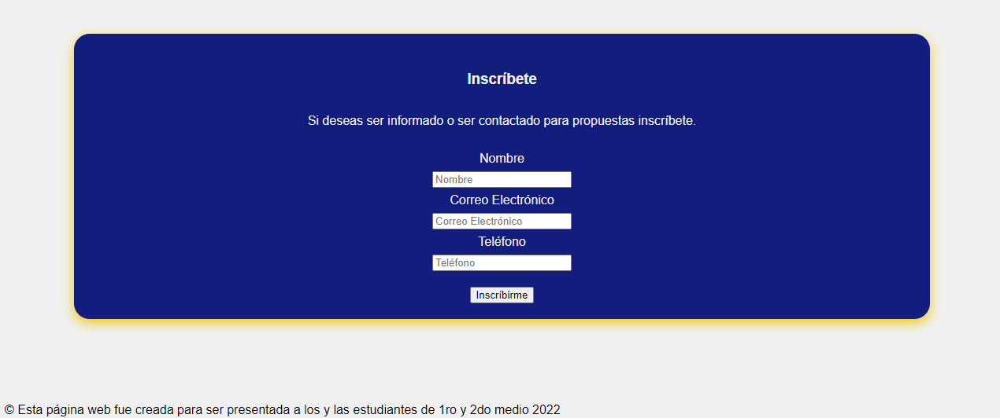
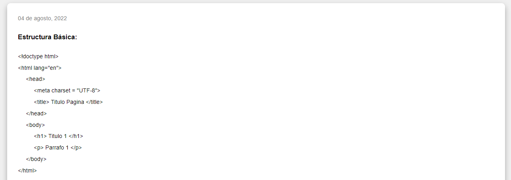
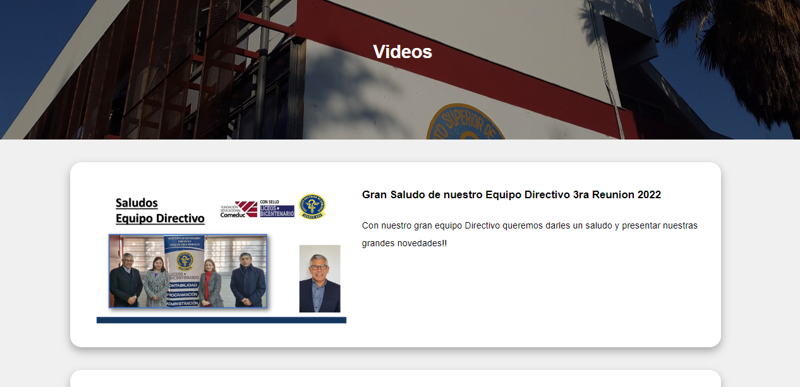
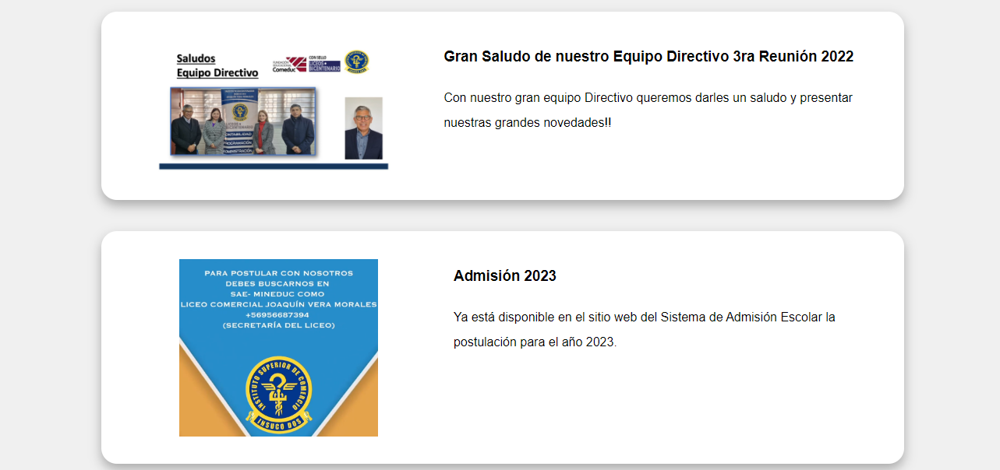
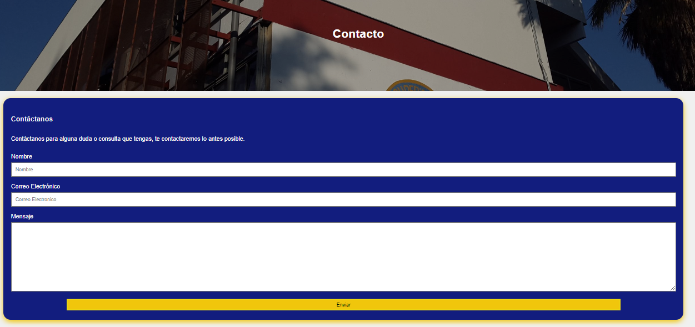

# InsucoDos - Blog
Esta página fue creada principalmente porque un profesor me la solicitó para presentarla en una
feria TP de mi escuela, básicamente es un "Blog" de la escuela donde publican algunas clases
o suben links de sus videos de distintas redes sociales, la barra de navegación tiene 2 tipos de links los cuales son: internos que serian el logo de la escuela, "Blog", "Videos" y "Contacto" el siguiente seria un link externo el cual es el logo de Comeduc, tambien tiene formulario en el encabezado
para poder inscribirse y asi poder enviarle una notificación cuando publiquen algo nuevo (Aun no funcional al ser puro HTML y CSS), al final de la pagina hay un formulario mas completo al igual que en cada publicación y en la parte de videos, por ultimo en la pagina de contacto contiene otro formulario en el cual introduces tu nombre, correo electrónico y un espacio para escribir algún mensaje a la escuela por si tienes alguna duda y/o solicitud.

# Imagenes Demostrativas
***Barra Navegacion y Encabezado***

***Publiaciones***

***Formulario y Pie de Pagina***

***Publicacion***

***Videos***

***Contacto***

# Visitar Sitio Web
Si desea visitar el sitio web el link es:
 
insucodos-blog.netlify.app

# Agradecimiento
Gracias por darse el tiempo de revisar este repositorio y tambien si revisó la pagina web.
 
Si le llegó a gustar porfaavor dejar una estrella ;).
Y si te llama la atención la programación animate que es muy interesante y divertida (quisas algo frustrante).